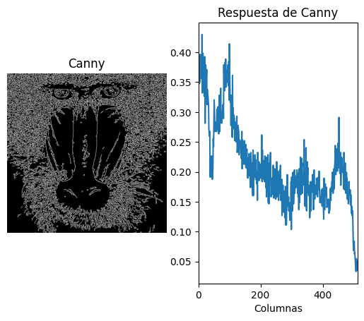
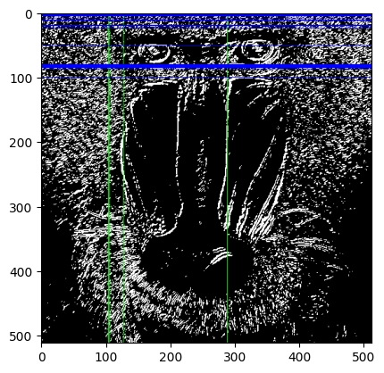

# Visión por computador - Práctica II
## Autores
 - Juan Carlos Rodríguez Ramírez
 - Mohamed O. Haroun Zarkik

## Introducción
En la segunda práctica de Visión por Computador se exploran diferentes técnicas de procesamiento de imágenes, utilizando principalmente la librería OpenCV. A lo largo de las tareas, se abordan métodos clásicos de detección de bordes y análisis de imágenes, como los operadores de Canny y Sobel, aplicando conteos y visualizaciones que permiten comprender mejor la estructura y los patrones presentes en las imágenes. La realización de las tareas tienen, de forma general, el objetivo de la obtención de diferentes carácteristicas de las imágenes. Finalmente, en la última tarea se hace uso de librerías externas con las cuales se controlará el volumen mediante la posición de los dedos.

## Entorno y librerías
Para el funcionamiento de esta práctica será necesario tener las librerías instaladas del proyecto base, así como tres nuevas para la ejecución de la última tarea, instalables con la siguiente instrucción

```bash
pip install comtypes pycaw mediapipe
```

Las siguientes librerías realizan las siguientes funciones:
- MediaPipe es una librería de Google orientada a visión por computador que ya trae modelos de machine learning listos para usar en tiempo real, como detección de manos, caras o poses corporales. En esta tarea se usa para detectar los puntos clave (landmarks) de la mano, en particular el pulgar e índice, y con esa información calcular distancias que luego controlan el volumen.

- PyCAW (Python Core Audio Windows Library) es una librería que permite manipular el volumen del sistema en Windows a través de la API de audio de Windows (Core Audio API). En este proyecto se usa para convertir la distancia entre dedos, detectada con MediaPipe, en cambios directos del volumen del sistema.

- comtypes es una librería de Python que actúa como interfaz con componentes COM de Windows (una tecnología de Microsoft para comunicación entre aplicaciones y librerías del sistema). PyCAW depende de comtypes para poder interactuar con la API de audio de Windows, de manera que se pueda acceder y modificar el nivel de volumen.

## Tarea I
El objetivo de esta primera tarea es realizar el conteo de píxeles blancos por filas en la imagen obtenida tras aplicar el detector de bordes de Canny, en lugar de hacerlo por columnas. Se debe determinar el valor máximo de píxeles blancos por fila (maxfil) y mostrar tanto el número de filas como sus posiciones correspondientes, siempre que el número de píxeles blancos en dichas filas sea mayor o igual al 90% de maxfil. La imagen resultante del operador de Canny contiene únicamente valores 0 o 255. 
Para el cálculo se utiliza la función cv2.reduce, que permite obtener la suma de valores por fila. Posteriormente, la suma se normaliza dividiendo entre el número de columnas de la imagen y el valor máximo de un píxel (255), obteniendo así el número de píxeles blancos por fila en valor normalizado. A partir de este resultado se calcula el umbral correspondiente al 90% de maxfil y se seleccionan las filas cuyo número de píxeles blancos sea igual o superior a dicho valor. 
El programa finalmente muestra una representación gráfica con dos partes: la imagen de Canny en escala de grises original y la respuesta de Canny por filas, donde se representa la evolución del número de píxeles blancos a lo largo de la imagen, lo que permite identificar de forma visual las filas que alcanzan al menos el 90% del máximo detectado.

En el resultado final se muestra cómo en las filas superiores se encuentran los valores más altos, ya que ahí se encuentra la región más blanca de la imagen. En medio de la gráfica se observa un descenso relevante debido a zona negra en la región de la nariz. Finalmente hay un nuevo repunte que correspondería a la barbilla del simio.



## Tarea II
Para la realización de esta tarea se aplica un umbralizado sobre la imagen obtenida tras el operador de Sobel, previamente convertida a formato de 8 bits para facilitar el procesamiento. El umbral seleccionado permite destacar los bordes más intensos en la imagen, generando una máscara binaria donde los píxeles relevantes toman el valor 255.

A continuación, se realiza el conteo de píxeles blancos (valor 255) tanto por filas como por columnas. Para cada caso, se calcula el valor máximo de píxeles blancos encontrados en una fila o columna, y se determina el conjunto de filas y columnas cuyo conteo supera el 90% de dicho máximo. Estas posiciones se remarcan sobre la imagen original del mandril utilizando líneas de color (de color verde las verticales, y de azul las horizontales), facilitando la visualización de las zonas con mayor presencia de bordes según Sobel.

En el resultado final se puede comprobar que las líneas se ubican en las posiciones esperadas.



## Tarea III
La tarea consiste en realizar un carrusel de modos aprendidos durante la asignatura. Para ello, además de poder visualizar la imagen original de la webcam, el programa debe ofrecer la posibilidad de cambiar de modo e incluir al menos dos procesamientos diferentes utilizando las funciones de OpenCV trabajadas previamente. La implementación desarrollada incorpora cinco modos que pueden seleccionarse mediante clics de ratón: modo normal, donde se muestra la imagen sin alteraciones; modo en escala de grises, que convierte el flujo de vídeo a tonalidades grises; modo de diferencia, que calcula el cambio entre fotogramas consecutivos para destacar el movimiento en la escena; modo de localización de zonas más claras y oscuras, donde se identifican los píxeles de mayor y menor intensidad dibujando círculos de colores sobre ellos; y finalmente, un modo artístico de estilo “Pop Art”, que reduce la resolución de la imagen en celdas, calcula la intensidad promedio en cada una y genera un patrón de círculos coloreados en función de dicha intensidad. En todos los casos, el programa muestra un texto sobre la ventana indicando el modo activo y permite cambiar de uno a otro con un clic izquierdo, volviendo al modo normal con un clic derecho. Además, el sistema asegura la conversión a formato BGR en aquellos modos donde la salida es en escala de grises. Para finalizar la ejecución, se pulsa la tecla ESC. Este demostrador ejemplifica de forma interactiva distintas técnicas de procesamiento de imagen aprendidas en clase y facilita su exhibición de manera visual y atractiva.

## Tarea IV
En esta tarea se ha desarrollado un demostrador inspirado en las demostraciones interactivas vistas en los vídeos propuestos. El sistema utiliza la cámara web y el módulo [MediaPipe](https://chuoling.github.io/mediapipe/) Hands para detectar la posición de la mano y sus dedos en tiempo real. El procesamiento de imagen permite identificar la distancia entre la punta del pulgar y la del índice, y esta distancia se emplea para controlar el volumen del sistema de sonido de Windows de forma intuitiva y visual. El control del volumen en los sistemas Windows se realiza mediante la librería [pycaw](https://github.com/AndreMiras/pycaw).

A continuación se muestran los bloques de código más relevantes para entender el funcionamiento:

**Inicialización de MediaPipe Hands y Pycaw para controlar el volumen:**
```python
import mediapipe as mp
from pycaw.pycaw import AudioUtilities, IAudioEndpointVolume
# ...inicialización de MediaPipe Hands...
hands = mp.solutions.hands.Hands(min_detection_confidence=0.7, min_tracking_confidence=0.7)
# ...configuración de Pycaw...
devices = AudioUtilities.GetSpeakers()
interface = devices.Activate(IAudioEndpointVolume._iid_, CLSCTX_ALL, None)
volume = cast(interface, POINTER(IAudioEndpointVolume))
```

**Captura de imagen de la webcam y procesamiento con MediaPipe:**
```python
cap = cv2.VideoCapture(0)
ret, frame = cap.read()
rgb = cv2.cvtColor(frame, cv2.COLOR_BGR2RGB)
results = hands.process(rgb)
```

**Obtención de las posiciones de los dedos (pulgar e índice) y cálculo de la distancia:**
```python
x1, y1 = int(hand_landmarks.landmark[4].x * w), int(hand_landmarks.landmark[4].y * h)
x2, y2 = int(hand_landmarks.landmark[8].x * w), int(hand_landmarks.landmark[8].y * h)
length = np.hypot(x2 - x1, y2 - y1)
```

**Mapeo de la distancia entre dedos al rango de volumen y ajuste del volumen del sistema:**
```python
vol = np.interp(length, [20, 200], [min_vol, max_vol])
volume.SetMasterVolumeLevel(vol, None)
```

**Visualización de la mano, los puntos clave y la barra de volumen en pantalla:**
```python
cv2.circle(frame, (x1, y1), 8, (255, 0, 0), cv2.FILLED)
cv2.circle(frame, (x2, y2), 8, (255, 0, 0), cv2.FILLED)
cv2.line(frame, (x1, y1), (x2, y2), (0, 255, 0), 3)
cv2.rectangle(frame, (50, int(vol_bar)), (85, 400), (0, 255, 0), cv2.FILLED)
```

El usuario puede modificar el volumen simplemente acercando o separando los dedos, mientras que la interfaz muestra en pantalla la mano detectada, los puntos clave y una barra de volumen que se actualiza dinámicamente. Este código hace uso de la visión por computador para crear un nuevo tipo de interfaz más natural y novedosa.
